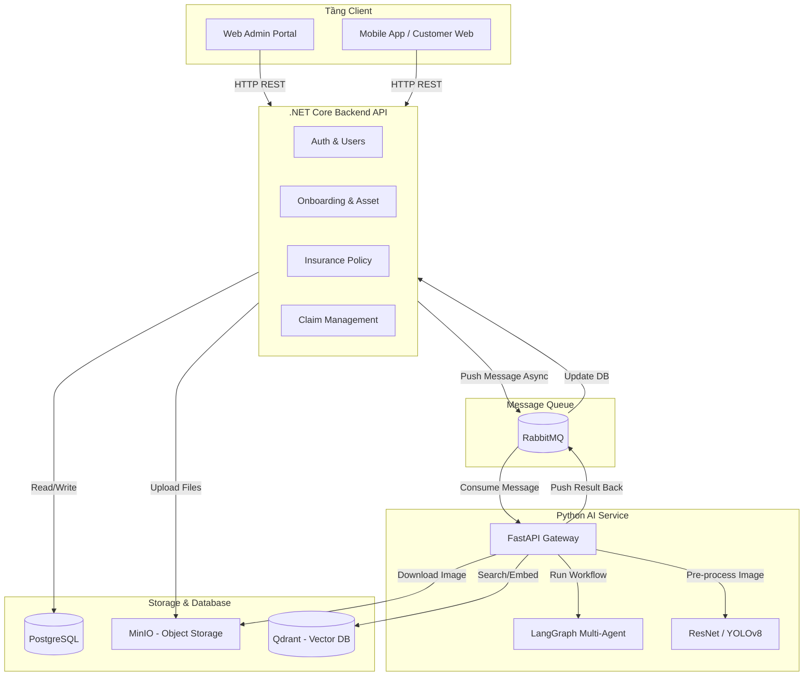

# 9. Kiến trúc Hệ thống & Cấu trúc Thư mục (Architecture & Folder Structure)

Tài liệu này phác họa bức tranh tổng thể về Kiến trúc hệ thống phân tán (Microservices) và Cấu trúc tổ chức thư mục của mã nguồn Backend.

---

## 1. Kiến trúc Hệ thống Tổng thể (System Architecture)

Hệ thống được thiết kế theo hướng Tách rời (Decoupled) để tối ưu hiệu năng và dễ dàng mở rộng (Scale). Sơ đồ dưới đây mô tả cách các thành phần giao tiếp với nhau:



**Diễn giải luồng chạy:**
- Tầng **Backend (.NET)** chịu trách nhiệm giao tiếp với Client, quản lý logic nghiệp vụ và ghi xuống CSDL chính (PostgreSQL).
- Khi có các tác vụ nặng (như Nhúng Vector điều khoản, hay Phân tích gian lận bồi thường), .NET không làm trực tiếp mà ném một sự kiện (Message) vào **RabbitMQ**.
- Tầng **AI Service (Python)** làm nhiệm vụ công nhân (Worker), liên tục lấy Message từ RabbitMQ ra để chạy các mô hình AI. Xong việc, nó ném kết quả ngược lại cho .NET cập nhật.
- File cứng (PDF, Ảnh) luôn được ném vào **MinIO**. Cả .NET và Python đều chọc vào MinIO để lấy file thông qua đường dẫn chung.

---

## 2. Kiến trúc Thư mục Mã nguồn (Project Folder Structure)

Toàn bộ Source Code Backend `.NET` được tổ chức chuẩn xác theo mô hình **Clean Architecture (Onion Architecture)**. Bạn có thể thấy rõ sự phân tách lớp (Layers) này trong thư mục `src/backend/src/`:

```text
📁 src/backend/src/
├── 📁 Backend.Domain/               # LÕI TRUNG TÂM (KHÔNG phụ thuộc thư viện ngoài)
│   ├── 📁 Entities/                 # Chứa các Thực thể cốt lõi (User, Car, PolicyTerm, ClaimRequest...)
│   ├── 📁 Enums/                    # Các hằng số Enum (DocumentType, ClaimStatus, EmbeddingStatus...)
│   └── 📁 Exceptions/               # Các lỗi nghiệp vụ tùy chỉnh (Domain Exceptions)
│
├── 📁 Backend.Application/          # LỚP NGHIỆP VỤ (USE CASES)
│   ├── 📁 Interfaces/               # Các interface giao tiếp (IFileStorage, IMessagePublisher, IUserRepository)
│   ├── 📁 UseCases/ (CQRS)          # Nơi chứa các Command/Query (VD: CreateClaimCommand, UpdatePolicyTermCommand)
│   └── 📁 DTOs/                     # Data Transfer Objects
│
├── 📁 Backend.Infrastructure/       # LỚP HẠ TẦNG (Tương tác với thế giới bên ngoài)
│   ├── 📁 Data/                     # DbContext của Entity Framework Core, Configurations (Fluent API), Migrations
│   ├── 📁 Repositories/             # Triển khai thực tế các lệnh CRUD DB (Kế thừa từ Interfaces)
│   ├── 📁 Services/                 # Các dịch vụ tích hợp (MinioStorageService, RabbitMqPublisherService)
│   └── 📁 AI/                       # Các HTTP Client gọi sang Python AI Service (Nếu cần gọi trực tiếp)
│
└── 📁 Backend.WebApi/               # LỚP GIAO TIẾP NGOÀI (CỬA NGÕ)
    ├── 📁 Controllers/              # Nơi phơi API (Auth, Users, Claims, Policies...)
    ├── 📁 Middlewares/              # Xử lý Exception tập trung, Ghi log toàn hệ thống
    ├── 📁 Extensions/               # Đăng ký Dependency Injection (Services.Add...)
    └── Program.cs                   # File khởi động ứng dụng
```

**Quy tắc ngầm của Kiến trúc này:**
- `Domain` là trung tâm, không được phép `using` bất kỳ thư viện nào khác.
- `Application` chỉ được chọc vào `Domain`. Nó định nghĩa "Tôi cần một kho lưu trữ DB", nhưng không quan tâm DB đó là SQL Server hay Postgres.
- `Infrastructure` chọc vào `Application` và cài đặt các yêu cầu đó (Sử dụng Postgres, MinIO).
- `WebApi` chỉ làm nhiệm vụ duy nhất là nhận HTTP Request, ném vào `Application` xử lý, và trả về HTTP Response.
